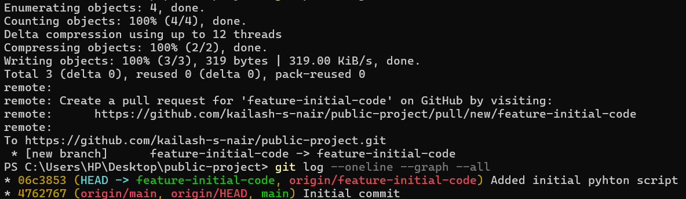

# public-project
### Kailash Subash Nair
### 100932798
## Project Overview  
This is a public project demonstrating the use of GitHub's Project Board, issues, and version control. It includes:  
- A **GitHub repository** for managing source code  
- A **GitHub Project Board** for tracking tasks  
- Feature branches, commits, and pull requests  
## Features  
-  Project setup with GitHub  
-  Basic Python script (`main.py`)  
-  Issue tracking and task management  
-  Version control with Git
## Project Board
We use a GitHub Project Board to track progress. Check the Issues tab to find open tasks. 
#  GitHub Log  

    
This is the screenshot of the git log.  
